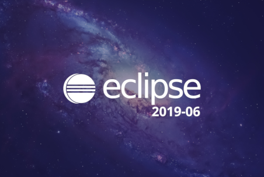
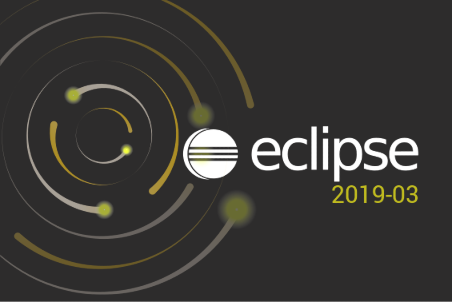
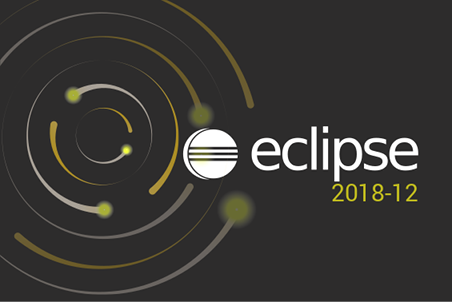
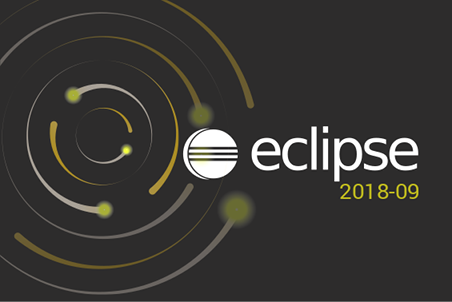
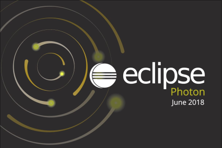
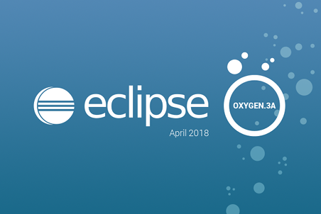
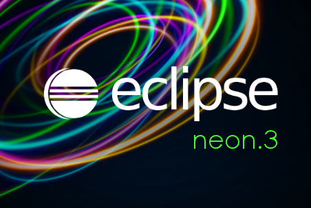
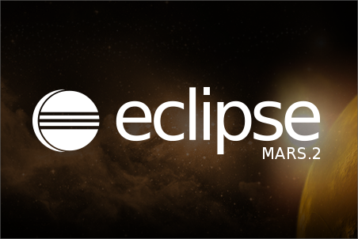
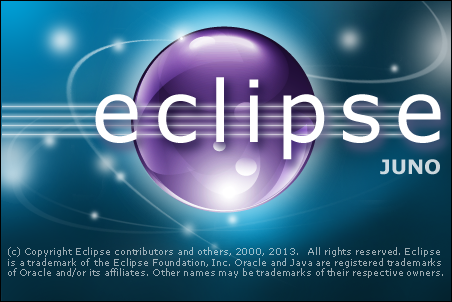

Eclipse 启动画面 在`eclipse-jee-2019-06-R-win32-x86_64\eclipse\plugins\org.eclipse.platform_4.12.0.v20190605-1800` 中,对应官网的[Project download area | The Eclipse Foundation](https://download.eclipse.org/releases/2019-06/201906191000/plugins/?d) 中的 `org.eclipse.platform_4.12.0.v20190605-1800.jar` 文件

# 2019-06
4.12.0.v20190605-1800

[eclipse_lg.png](4.12.0.v20190605-1800/eclipse_lg.png)
[eclipse1024.png](4.12.0.v20190605-1800/eclipse1024.png)
[eclipse128.png](4.12.0.v20190605-1800/eclipse128.png)
[eclipse16.gif](4.12.0.v20190605-1800/eclipse16.gif)
[eclipse16.png](4.12.0.v20190605-1800/eclipse16.png)
[eclipse22.png](4.12.0.v20190605-1800/eclipse22.png)
[eclipse24.png](4.12.0.v20190605-1800/eclipse24.png)
[eclipse256.gif](4.12.0.v20190605-1800/eclipse256.gif)
[eclipse256.png](4.12.0.v20190605-1800/eclipse256.png)
[eclipse32.gif](4.12.0.v20190605-1800/eclipse32.gif)
[eclipse32.png](4.12.0.v20190605-1800/eclipse32.png)
[eclipse48.gif](4.12.0.v20190605-1800/eclipse48.gif)
[eclipse48.png](4.12.0.v20190605-1800/eclipse48.png)
[eclipse512.png](4.12.0.v20190605-1800/eclipse512.png)
[eclipse64.png](4.12.0.v20190605-1800/eclipse64.png)
[intro-eclipse.png](4.12.0.v20190605-1800/intro-eclipse.png)
[splash.bmp](4.12.0.v20190605-1800/splash.bmp)

# 2019-03
4.11.0.v20190109-1800

[eclipse_lg.png](4.11.0.v20190109-1800/eclipse_lg.png)
[eclipse1024.png](4.11.0.v20190109-1800/eclipse1024.png)
[eclipse128.png](4.11.0.v20190109-1800/eclipse128.png)
[eclipse16.gif](4.11.0.v20190109-1800/eclipse16.gif)
[eclipse16.png](4.11.0.v20190109-1800/eclipse16.png)
[eclipse22.png](4.11.0.v20190109-1800/eclipse22.png)
[eclipse24.png](4.11.0.v20190109-1800/eclipse24.png)
[eclipse256.gif](4.11.0.v20190109-1800/eclipse256.gif)
[eclipse256.png](4.11.0.v20190109-1800/eclipse256.png)
[eclipse32.gif](4.11.0.v20190109-1800/eclipse32.gif)
[eclipse32.png](4.11.0.v20190109-1800/eclipse32.png)
[eclipse48.gif](4.11.0.v20190109-1800/eclipse48.gif)
[eclipse48.png](4.11.0.v20190109-1800/eclipse48.png)
[eclipse512.png](4.11.0.v20190109-1800/eclipse512.png)
[eclipse64.png](4.11.0.v20190109-1800/eclipse64.png)
[intro-eclipse.png](4.11.0.v20190109-1800/intro-eclipse.png)
[splash.bmp](4.11.0.v20190109-1800/splash.bmp)

# 2018-12
4.10.0.v20181206-0815

[eclipse_lg.png](4.10.0.v20181206-0815/eclipse_lg.png)
[eclipse1024.png](4.10.0.v20181206-0815/eclipse1024.png)
[eclipse128.png](4.10.0.v20181206-0815/eclipse128.png)
[eclipse16.gif](4.10.0.v20181206-0815/eclipse16.gif)
[eclipse16.png](4.10.0.v20181206-0815/eclipse16.png)
[eclipse22.png](4.10.0.v20181206-0815/eclipse22.png)
[eclipse24.png](4.10.0.v20181206-0815/eclipse24.png)
[eclipse256.gif](4.10.0.v20181206-0815/eclipse256.gif)
[eclipse256.png](4.10.0.v20181206-0815/eclipse256.png)
[eclipse32.gif](4.10.0.v20181206-0815/eclipse32.gif)
[eclipse32.png](4.10.0.v20181206-0815/eclipse32.png)
[eclipse48.gif](4.10.0.v20181206-0815/eclipse48.gif)
[eclipse48.png](4.10.0.v20181206-0815/eclipse48.png)
[eclipse512.png](4.10.0.v20181206-0815/eclipse512.png)
[eclipse64.png](4.10.0.v20181206-0815/eclipse64.png)
[intro-eclipse.png](4.10.0.v20181206-0815/intro-eclipse.png)
[splash.bmp](4.10.0.v20181206-0815/splash.bmp)

# 2018-09
4.9.0.v20180906-0745

[eclipse_lg.png](4.9.0.v20180906-0745/eclipse_lg.png)
[eclipse1024.png](4.9.0.v20180906-0745/eclipse1024.png)
[eclipse128.png](4.9.0.v20180906-0745/eclipse128.png)
[eclipse16.gif](4.9.0.v20180906-0745/eclipse16.gif)
[eclipse16.png](4.9.0.v20180906-0745/eclipse16.png)
[eclipse22.png](4.9.0.v20180906-0745/eclipse22.png)
[eclipse24.png](4.9.0.v20180906-0745/eclipse24.png)
[eclipse256.gif](4.9.0.v20180906-0745/eclipse256.gif)
[eclipse256.png](4.9.0.v20180906-0745/eclipse256.png)
[eclipse32.gif](4.9.0.v20180906-0745/eclipse32.gif)
[eclipse32.png](4.9.0.v20180906-0745/eclipse32.png)
[eclipse48.gif](4.9.0.v20180906-0745/eclipse48.gif)
[eclipse48.png](4.9.0.v20180906-0745/eclipse48.png)
[eclipse512.png](4.9.0.v20180906-0745/eclipse512.png)
[eclipse64.png](4.9.0.v20180906-0745/eclipse64.png)
[intro-eclipse.png](4.9.0.v20180906-0745/intro-eclipse.png)
[splash.bmp](4.9.0.v20180906-0745/splash.bmp)

# photon
4.8.0.v20180611-0500

[eclipse_lg.png](4.8.0.v20180611-0500/eclipse_lg.png)
[eclipse1024.png](4.8.0.v20180611-0500/eclipse1024.png)
[eclipse128.png](4.8.0.v20180611-0500/eclipse128.png)
[eclipse16.gif](4.8.0.v20180611-0500/eclipse16.gif)
[eclipse16.png](4.8.0.v20180611-0500/eclipse16.png)
[eclipse22.png](4.8.0.v20180611-0500/eclipse22.png)
[eclipse24.png](4.8.0.v20180611-0500/eclipse24.png)
[eclipse256.gif](4.8.0.v20180611-0500/eclipse256.gif)
[eclipse256.png](4.8.0.v20180611-0500/eclipse256.png)
[eclipse32.gif](4.8.0.v20180611-0500/eclipse32.gif)
[eclipse32.png](4.8.0.v20180611-0500/eclipse32.png)
[eclipse48.gif](4.8.0.v20180611-0500/eclipse48.gif)
[eclipse48.png](4.8.0.v20180611-0500/eclipse48.png)
[eclipse512.png](4.8.0.v20180611-0500/eclipse512.png)
[eclipse64.png](4.8.0.v20180611-0500/eclipse64.png)
[intro-eclipse.png](4.8.0.v20180611-0500/intro-eclipse.png)
[splash.bmp](4.8.0.v20180611-0500/splash.bmp)

# oxygen
4.7.3.v20180330-0640

[eclipse_lg.png](4.7.3.v20180330-0640/eclipse_lg.png)
[eclipse1024.png](4.7.3.v20180330-0640/eclipse1024.png)
[eclipse128.png](4.7.3.v20180330-0640/eclipse128.png)
[eclipse16.gif](4.7.3.v20180330-0640/eclipse16.gif)
[eclipse16.png](4.7.3.v20180330-0640/eclipse16.png)
[eclipse22.png](4.7.3.v20180330-0640/eclipse22.png)
[eclipse24.png](4.7.3.v20180330-0640/eclipse24.png)
[eclipse256.gif](4.7.3.v20180330-0640/eclipse256.gif)
[eclipse256.png](4.7.3.v20180330-0640/eclipse256.png)
[eclipse32.gif](4.7.3.v20180330-0640/eclipse32.gif)
[eclipse32.png](4.7.3.v20180330-0640/eclipse32.png)
[eclipse48.gif](4.7.3.v20180330-0640/eclipse48.gif)
[eclipse48.png](4.7.3.v20180330-0640/eclipse48.png)
[eclipse512.png](4.7.3.v20180330-0640/eclipse512.png)
[eclipse64.png](4.7.3.v20180330-0640/eclipse64.png)
[intro-eclipse.png](4.7.3.v20180330-0640/intro-eclipse.png)
[splash.bmp](4.7.3.v20180330-0640/splash.bmp)

# neon
4.6.3.v20170301-0400 

[eclipse_lg.png](4.6.3.v20170301-0400/eclipse_lg.png)
[eclipse1024.png](4.6.3.v20170301-0400/eclipse1024.png)
[eclipse128.png](4.6.3.v20170301-0400/eclipse128.png)
[eclipse16.gif](4.6.3.v20170301-0400/eclipse16.gif)
[eclipse16.png](4.6.3.v20170301-0400/eclipse16.png)
[eclipse22.png](4.6.3.v20170301-0400/eclipse22.png)
[eclipse24.png](4.6.3.v20170301-0400/eclipse24.png)
[eclipse256.gif](4.6.3.v20170301-0400/eclipse256.gif)
[eclipse256.png](4.6.3.v20170301-0400/eclipse256.png)
[eclipse32.gif](4.6.3.v20170301-0400/eclipse32.gif)
[eclipse32.png](4.6.3.v20170301-0400/eclipse32.png)
[eclipse48.gif](4.6.3.v20170301-0400/eclipse48.gif)
[eclipse48.png](4.6.3.v20170301-0400/eclipse48.png)
[eclipse512.png](4.6.3.v20170301-0400/eclipse512.png)
[eclipse64.png](4.6.3.v20170301-0400/eclipse64.png)
[intro-eclipse.png](4.6.3.v20170301-0400/intro-eclipse.png)
[splash.bmp](4.6.3.v20170301-0400/splash.bmp)

# mars
4.5.2.v20160212-1500

[eclipse_lg.gif](4.5.2.v20160212-1500/eclipse_lg.gif)
[eclipse_lg.png](4.5.2.v20160212-1500/eclipse_lg.png)
[eclipse1024.png](4.5.2.v20160212-1500/eclipse1024.png)
[eclipse128.png](4.5.2.v20160212-1500/eclipse128.png)
[eclipse16.gif](4.5.2.v20160212-1500/eclipse16.gif)
[eclipse16.png](4.5.2.v20160212-1500/eclipse16.png)
[eclipse22.png](4.5.2.v20160212-1500/eclipse22.png)
[eclipse24.png](4.5.2.v20160212-1500/eclipse24.png)
[eclipse256.gif](4.5.2.v20160212-1500/eclipse256.gif)
[eclipse256.png](4.5.2.v20160212-1500/eclipse256.png)
[eclipse32.gif](4.5.2.v20160212-1500/eclipse32.gif)
[eclipse32.png](4.5.2.v20160212-1500/eclipse32.png)
[eclipse48.gif](4.5.2.v20160212-1500/eclipse48.gif)
[eclipse48.png](4.5.2.v20160212-1500/eclipse48.png)
[eclipse512.png](4.5.2.v20160212-1500/eclipse512.png)
[eclipse64.png](4.5.2.v20160212-1500/eclipse64.png)
[intro-eclipse.png](4.5.2.v20160212-1500/intro-eclipse.png)
[splash.bmp](4.5.2.v20160212-1500/splash.bmp)

# luna
4.4.2.v20150204-1700

[eclipse_lg.gif](4.4.2.v20150204-1700/eclipse_lg.gif)
[eclipse_lg.png](4.4.2.v20150204-1700/eclipse_lg.png)
[eclipse1024.png](4.4.2.v20150204-1700/eclipse1024.png)
[eclipse128.png](4.4.2.v20150204-1700/eclipse128.png)
[eclipse16.gif](4.4.2.v20150204-1700/eclipse16.gif)
[eclipse16.png](4.4.2.v20150204-1700/eclipse16.png)
[eclipse22.png](4.4.2.v20150204-1700/eclipse22.png)
[eclipse24.png](4.4.2.v20150204-1700/eclipse24.png)
[eclipse256.gif](4.4.2.v20150204-1700/eclipse256.gif)
[eclipse256.png](4.4.2.v20150204-1700/eclipse256.png)
[eclipse32.gif](4.4.2.v20150204-1700/eclipse32.gif)
[eclipse32.png](4.4.2.v20150204-1700/eclipse32.png)
[eclipse48.gif](4.4.2.v20150204-1700/eclipse48.gif)
[eclipse48.png](4.4.2.v20150204-1700/eclipse48.png)
[eclipse512.png](4.4.2.v20150204-1700/eclipse512.png)
[eclipse64.png](4.4.2.v20150204-1700/eclipse64.png)
[intro-eclipse.png](4.4.2.v20150204-1700/intro-eclipse.png)
[splash.bmp](4.4.2.v20150204-1700/splash.bmp)

# kepler
4.3.2.v20140221-1700
[eclipse_lg.gif](4.3.2.v20140221-1700/eclipse_lg.gif)
[eclipse16.gif](4.3.2.v20140221-1700/eclipse16.gif)
[eclipse16.png](4.3.2.v20140221-1700/eclipse16.png)
[eclipse256.png](4.3.2.v20140221-1700/eclipse256.png)
[eclipse32.gif](4.3.2.v20140221-1700/eclipse32.gif)
[eclipse32.png](4.3.2.v20140221-1700/eclipse32.png)
[eclipse48.gif](4.3.2.v20140221-1700/eclipse48.gif)
[eclipse48.png](4.3.2.v20140221-1700/eclipse48.png)
[intro-eclipse.png](4.3.2.v20140221-1700/intro-eclipse.png)
[splash.bmp](4.3.2.v20140221-1700/splash.bmp)

# juno
4.2.2.v201302041200

[eclipse_lg.gif](4.2.2.v201302041200/eclipse_lg.gif)
[eclipse16.gif](4.2.2.v201302041200/eclipse16.gif)
[eclipse16.png](4.2.2.v201302041200/eclipse16.png)
[eclipse256.png](4.2.2.v201302041200/eclipse256.png)
[eclipse32.gif](4.2.2.v201302041200/eclipse32.gif)
[eclipse32.png](4.2.2.v201302041200/eclipse32.png)
[eclipse48.gif](4.2.2.v201302041200/eclipse48.gif)
[eclipse48.png](4.2.2.v201302041200/eclipse48.png)
[intro-eclipse.png](4.2.2.v201302041200/intro-eclipse.png)
[splash.bmp](4.2.2.v201302041200/splash.bmp)

 

